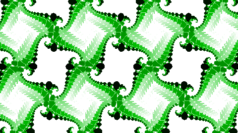
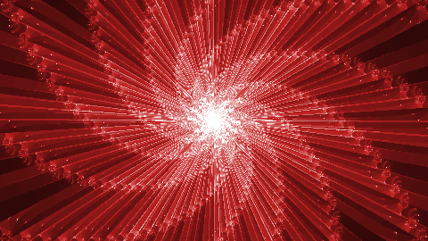
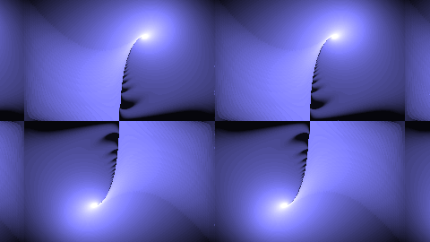

# Julia Sets

Set of packages for WebGL-assisted rendering of fractals based on [Julia sets].

## Packages

- [`julia-set`](packages/julia-set) is the base package usable in modern browsers
- [`julia-set-node`](packages/julia-set-node) is the server-side version, which uses
  [Puppeteer] to perform rendering anywhere

## Examples

[Julia sets]: https://en.wikipedia.org/wiki/Julia_set
[Puppeteer]: https://npmjs.com/package/puppeteer
